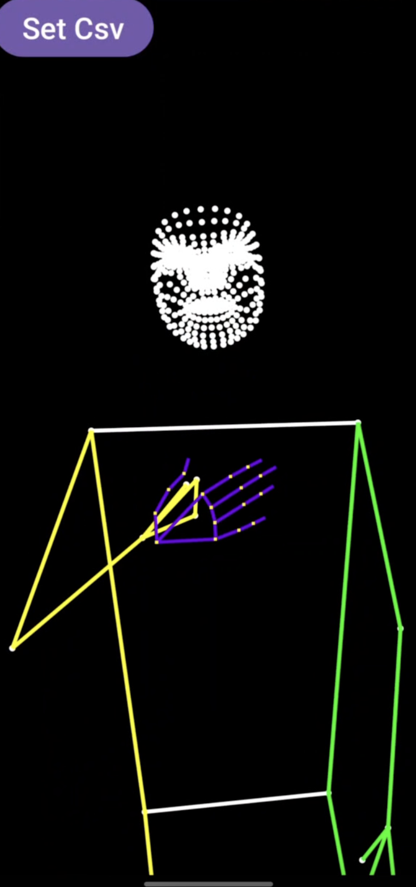

# LandmarksCollect
Android App to collect hands, pose and facemesh landmarkers in the format of Google MediaPipe landmarks of hands, pose and facemesh

## Collect anywhere anytime
1) Choose front or back camera
2) Set the name of the gesture and select where to save the motion frames
3) The app records a gesture 5 seconds for as many frames as recgonized (Usually 50-60 frames).
3 seconds long pause is given between the gestures. You can record 10 motion-sequences per session and stop/pause/resume any time

