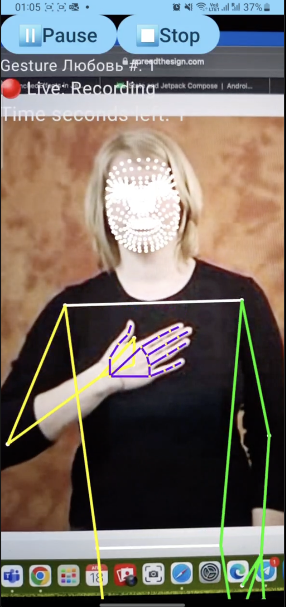

# LandmarksCollect

Android App to collect hands, pose and facemesh landmarkers in the format of Google MediaPipe
landmarks of hands, pose and facemesh

## Application
Since the app is in active development, it is currently not in Google Play, but is available for download from this repository.
Download the `.apk`-file and install on your Android device as regular.

### LandmarksCollect app 

## Collect anywhere anytime

1) Choose front or back camera
2) Set the name of the gesture and select where to save the motion frames
3) The app records a gesture 5 seconds for as many frames as recgonized (Usually 50-60 frames).
   3 seconds long pause is given between the gestures. You can record 10 motion-sequences per
   session and stop/pause/resume any time

 

<video src='https://user-images.githubusercontent.com/128403787/232767020-c9419605-20cc-4946-b079-efd94e288b36.mp4' width=180/>

<video src='https://user-images.githubusercontent.com/128403787/232760744-b31b4249-3957-4399-b643-39d53edb4c79.mp4' width=180/>
